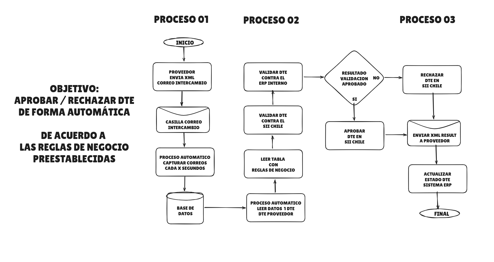

# Diagrama de Flujo – Aprobación / Rechazo Automático de DTE

## 🎯 Objetivo General

Aprobar o rechazar automáticamente un **DTE (Documento Tributario Electrónico)**  
según **reglas de negocio preestablecidas**, sin intervención humana.

Este proceso está orientado a:
- Automatizar cuentas por pagar
- Cumplir con normativa del **SII Chile**
- Reducir errores operativos
- Acelerar validaciones y pagos

---

## 🔄 PROCESO 01 – Recepción del DTE

Este proceso se encarga de **recibir el DTE enviado por el proveedor**.

### 1️⃣ Inicio
Se activa el sistema automático de recepción.

### 2️⃣ Envío del XML por el proveedor
El proveedor envía el **XML del DTE** al correo de intercambio definido por el SII.

### 3️⃣ Casilla de correo de intercambio
El ERP dispone de una **casilla exclusiva** para recibir DTEs.

### 4️⃣ Proceso automático de lectura
Un servicio automático:
- Revisa la casilla cada X segundos
- Descarga correos nuevos
- Extrae el XML adjunto

(Ejemplos: cron job, daemon, worker)

### 5️⃣ Almacenamiento en Base de Datos
Se guarda el XML y sus datos relevantes:
- RUT proveedor
- Folio
- Tipo de DTE
- Fecha
- Monto
- XML original

📌 Fin del Proceso 01

---

## 🔍 PROCESO 02 – Validación del DTE

Este proceso evalúa si el DTE cumple con todas las condiciones.

### 6️⃣ Lectura del DTE
El sistema selecciona **un DTE pendiente** desde la base de datos.

### 7️⃣ Lectura de reglas de negocio
Se consulta una tabla de reglas configurable:
- Proveedor autorizado
- Monto máximo permitido
- Orden de compra válida
- Centro de costo permitido
- Tipo de DTE aceptado

💡 Permite modificar reglas sin cambiar código.

### 8️⃣ Validación contra el SII Chile
Se valida:
- Existencia del DTE
- Estado tributario
- Autenticidad del documento
- Que no esté anulado

### 9️⃣ Validación contra ERP interno
Se cruza información con:
- Órdenes de compra
- Recepciones
- Contratos
- Presupuestos

Resultado: **APROBADO** o **NO APROBADO**

---

## ✅❌ PROCESO 03 – Decisión Final

### 🔀 Evaluación del resultado

#### ❌ DTE NO APROBADO
Acciones:
1. Rechazar el DTE en el SII
2. Enviar XML de rechazo al proveedor
3. Registrar el rechazo en el ERP

Ejemplos:
- Monto incorrecto
- Proveedor no autorizado
- Sin orden de compra válida

---

#### ✅ DTE APROBADO
Acciones:
1. Aprobar el DTE en el SII
2. Enviar XML de aprobación al proveedor
3. Actualizar estado en el ERP:
   - DTE aprobado
   - Listo para pago
   - Contabilizable

---

### 🔚 Fin del Proceso

El flujo termina correctamente con trazabilidad completa.

---

## 🧠 Resumen

> El sistema recibe automáticamente un DTE, lo valida contra reglas internas y el SII, decide aprobar o rechazar, informa al proveedor y actualiza el ERP sin intervención humana.

---

## 🚀 Aplicaciones

Ideal para:
- Sistemas ERP
- SaaS de facturación electrónica
- Automatización contable
- Cumplimiento tributario en Chile

